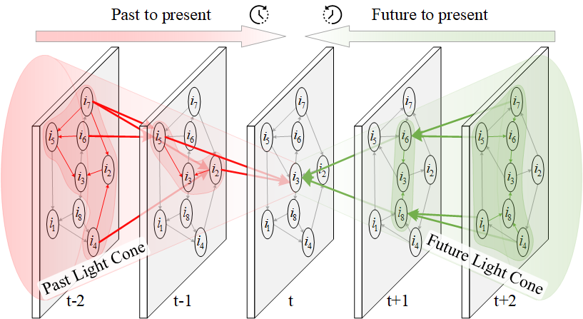

# Learning from the Future: Light Cone Modeling for Sequential Recommendation

<!-- Bidirectional Sequential Graph Convolutional Network (BiSGCN) -->

Modeling sequential behaviors is the core of sequential recommendation.
As users visit items in chronological order, existing methods typically capture a user's present interests from his/her past-to-present behaviors, i.e., making recommendations with only the unidirectional past information.
This paper argues that future information is another critical factor for the sequential recommendation.
However, directly learning from future-to-present behaviors inevitably causes data leakage.
Here, it is pointed out that future information can be learned from users' collaborative behaviors.
Toward this end, this paper introduces sequential graphs to depict item transition relationships: where and how each item transits from and will transit to.
This temporal evolution information is called the light cone in special and general relativity.
Then, a Bidirectional Sequential Graph Convolutional Network (BiSGCN) is proposed to learn item representations by encoding past and future light cones.
Finally, a Manifold Translating Embedding (MTE) method is proposed to model item transition patterns in Riemannian manifolds, which helps to better capture geometric structures of light cones and item transition patterns.
Experimental comparisons and ablation studies verify the outstanding performance of BiSGCN, the benefits of learning from the future, and the improvements of learning in Riemannian manifolds.

<p align="center">
    <br>
    <b>Bidirectional Sequential Graph Convolutional Network</b>
</p>

## Highlights

- This paper points out that future information can be learned from users' collaborative behaviors.
- We prove the necessity of future information for capturing users' dynamic interests from the information-theoretic perspective.
- Sequential graphs are used to depict item transition relationships: where and how each item transits from and will transit to.
- A Bidirectional Sequential Graph Convolutional Network (BiSGCN) is proposed to learn item representations by encoding past and future light cones.
- A Manifold Translating Embedding (MTE) method is proposed to model item transition patterns in Riemannian manifolds.

## Requirements

We provide TensorFlow implementations for BiSGCN model.

- Python==3.6
- TensorFlow==1.14
- RecKit==0.2.4

**Note**:

- The current code works well with TensorFlow 1.14
- [RecKit](https://github.com/ZhongchuanSun/reckit) provides an efficient evaluator that is implemented with C++ code.

## Run

```bash
python run_model.py
```

## Citation

If you find this useful for your research, please kindly cite the following paper.

```bibtex
@article{tcyb:2022:bisgcn,
  title   = {Learning from the Future: Light Cone Modeling for Sequential Recommendation},
  author  = {Sun, Zhongchuan and Wu, Bin and Chen, Yifan and Ye, Yangdong},
  journal = {IEEE Transactions on Cybernetics},
  volume  = {},
  pages   = {1--14},
  year    = {2022},
  doi     = {10.1109/TCYB.2022.3222259}
}
```
